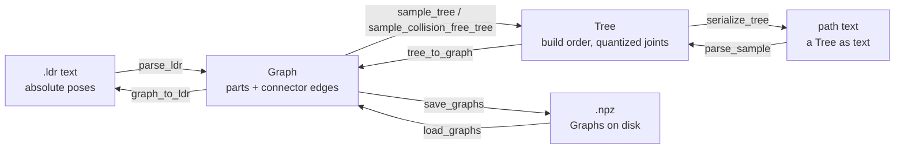

<div align="center">

# BrickNet: Graph-Backed Generative Brick Assembly

[Peter Kulits](https://kulits.github.io/) and [Cordelia Schmid](https://cordeliaschmid.github.io/)

CVPR 2026

[\[Project Page\]](https://kulits.github.io/BrickNet/) | [\[Models\]](https://huggingface.co/collections/kulits/bricknet) | [\[Dataset\]](https://forms.gle/dm4eYSa5gh4DqzRT6)


</div>

## Install

```bash
pip install bricknet
```

Collision checking requires the per-part collision meshes (1.6 GB extracted):

```bash
python -m bricknet fetch-meshes
```

Meshes are stored in the platform user-data directory; set `BRICKNET_DATA` to use another location.

## Data Structures

There are three representations:

- **LDR**: standard [LDraw](https://www.ldraw.org/) model text; absolute part poses.
- **Graph**: part vocabulary ids, colors, optional absolute transforms, structured connector
  edges, connected components; persisted as batched `.npz`.
- **Tree**: a quantized spanning tree of one Graph component; a build order. Serialized as
  **path text**, the format we train on.

```python
import bricknet

g = bricknet.parse_ldr(open("model.ldr").read())   # LDR -> Graph
t = bricknet.sample_tree(g, 0, method="bfs")       # Graph -> Tree (component 0)
print(bricknet.serialize_tree(t))                  # Tree -> path text
```

Modules:

- `core`: shared types
- `data`: catalog and connector loaders
- `tree`: the path-text codec
- `collision`: the mesh collision kernel
- `graph`: parsing, sampling, realization, `.npz` I/O
- `score`: parse/collision evaluation of generated samples

## Generation

`scripts/generate.py` requires `torch transformers accelerate peft`.

Unconditional generation with a [PT model](https://huggingface.co/collections/kulits/bricknet):

```bash
python scripts/generate.py --model Qwen/Qwen3-0.6B --lora kulits/BrickNet-0.6B-PT \
    --output out.jsonl --num_samples 2048 --batch_size 128 --stop_after_newlines 199
```

Caption-conditioned generation with an SFT model (the SFT adapter stacks on the PT adapter;
the prompts file is a jsonl with a `caption` field):

```bash
python scripts/generate.py --model Qwen/Qwen3-0.6B \
    --lora kulits/BrickNet-0.6B-PT --lora kulits/BrickNet-0.6B-SFT \
    --output out.jsonl --prompts_file prompts.jsonl --batch_size 128
```

Output rows are `{"id", "sample", "text"}` with the path text under `text`.

Score the samples and turn them into viewable models:

```bash
python -m bricknet score out.jsonl scored.jsonl
python -m bricknet path2ldr out.jsonl -o models/   # one .ldr per sample
```

The `.ldr` files can be opened with an LDraw viewer such as [LDView](https://tcobbs.github.io/ldview/).

## Command Line

```bash
python -m bricknet sample models/ -o paths.jsonl      # build sequences from .ldr models, --n per component
python -m bricknet sample graphs.npz -o paths.jsonl   # same, from a graph batch
python -m bricknet score samples.jsonl scored.jsonl   # parsability + collision metrics (--no-collision: parse only)
python -m bricknet path2ldr sample.txt -o model.ldr   # generated path text -> viewable LDR
python -m bricknet path2ldr out.jsonl -o models/      # generator output: one .ldr per sample
```

`sample` and `score` read and write the same jsonl row format as the distributed path datasets.

## Evaluation

The paper's image--text metrics (PE / SigLIP 2 / VQAScore) are in `eval/`; see `eval/README.md`.

## Data

The part vocabulary, connector labels, and alias table ship inside the package; the collision
meshes are downloaded separately (see [Install](#install)). The datasets (graphs, captions, and pre-sampled
paths) are distributed via a [request form](https://forms.gle/dm4eYSa5gh4DqzRT6); see
[DATA.md](DATA.md) for schemas.

## Conversions



## Citation

```bibtex
@InProceedings{Kulits_2026_CVPR,
    author    = {Kulits, Peter and Schmid, Cordelia},
    title     = {BrickNet: Graph-Backed Generative Brick Assembly},
    booktitle = {Proceedings of the IEEE/CVF Conference on Computer Vision and Pattern Recognition (CVPR)},
    month     = {June},
    year      = {2026},
    pages     = {39252-39261}
}
```
